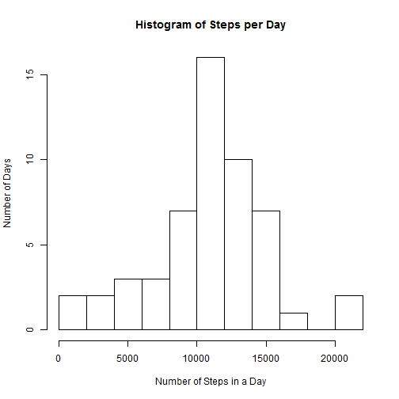
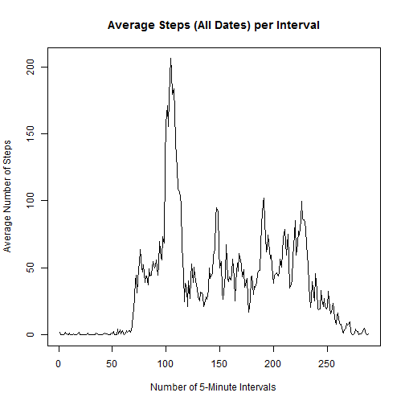
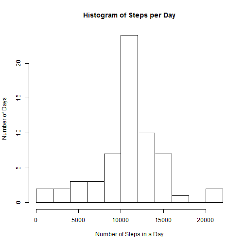
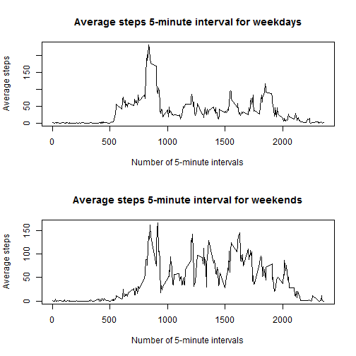

------------------------------------------------------------------------------

<h3>Part #1: Loading and preprocessing the data</h3>

Show any code that is needed to:

1. Load the data (i.e. read.csv())

2.Process/transform the data (if necessary) into a format suitable for your analysis

<h4>Part 1.1</h4>


```r
## House Keeping, clear all variables
rm(list=ls(all=TRUE))

## Load Data 
raw.data<-read.csv('activity.csv')
```

<h4>Part 1.2</h4>

Data is in a suitable format and does not neet to be transfromed

------------------------------------------------------------------------------

<h3>Part #2: What is mean total number of steps taken per day?</h3>

For this part of the assignment, you can ignore the missing values in the dataset.

1. Make a histogram of the total number of steps taken each day

2. Calculate and report the mean and median total number of steps taken per day

<h4>Part 2.1</h4>

<b>Calcualte the total number of steps taken per day:</b>


```r
## Subset the data to exclude missing values
working.data<-raw.data[complete.cases(raw.data),]

## Creates a vector of sampling dates 
dates<-as.matrix(unique(working.data[,2])) 

## Create vector containing the total number of steps per day
total<-vector(length=nrow(dates)) ##Initialize vector  
for (i in 1:nrow(dates) ) { ##Start loop
  temp<-subset(working.data, date == dates[i]) ##Subset data by date
  total[i]<-sum(temp[,1]) ##Calculate total
}
```

<b>Create Histogram Plot of the total number of steps per day:</b>


```r
## Plot historgram
hist(total,main="Histogram of Steps per Day", xlab="Number of Steps in a Day",ylab="Number of Days",breaks=10)
```

 

<h4>Part 2.2</h4>

<b>Calculate and display the mean total steps taken per day:</b>


```r
## Calculate mean
working.mean<-as.integer(mean(total))

## Display mean
working.mean
```

```
## [1] 10766
```

The mean number of steps taken per day is 10766

<b>Calculate and display the median total steps taken per day:</b>


```r
## Calcualte median
working.med<-median(total)

## Display median
working.med
```

```
## [1] 10765
```

The median number of steps taken per day is 10765


------------------------------------------------------------------------------

<h3>Part #3: What is the average daily activity pattern?</h3>

1. Make a time series plot (i.e. type = "l") of the 5-minute interval (x-axis) and the average number of steps taken, averaged across all days (y-axis)

2. Which 5-minute interval, on average across all the days in the dataset, contains the maximum number of steps?

<h4>Part 3.1</h4>

<b>Calculate the average number of steps taken per 5-minute interval:</b>


```r
## Creates a vector with sampling intervals 
inter<-as.matrix(unique(working.data[,3]))

## Create vector containing the average number of steps per interval for all days
total<-vector(length=nrow(inter)) ##Initialize vector 
for (i in 1:nrow(inter) ) { ##Start loop
  temp<-subset(working.data, interval == inter[i]) ##Subset data by interval
  total[i]<-mean(temp[,1]) ##Calculate total
}
```

<b>Plot average number of steps vs 5-minute interval:</b>


```r
## Plot Figure
plot(1:nrow(inter),total,type="l",
     main="Average Steps (All Dates) per Interval",
     xlab="Number of 5-Minute Intervals",
     ylab="Average Number of Steps")
```

 

<h4>Part 3.2</h4>

<b>Determine the 5-minute intervalcontaining the maximum number of steps taken:</b>


```r
## Determine interval with the most steps
which(total == max(total))
```

```
## [1] 104
```

The 5-minute interval with the most steps was interval 104


------------------------------------------------------------------------------

<h3>Part #4: Imputing missing values</h3>

Note that there are a number of days/intervals where there are missing values (coded as NA). The presence of missing days may introduce bias into some calculations or summaries of the data.

1. Calculate and report the total number of missing values in the dataset (i.e. the total number of rows with NAs)

2. Devise a strategy for filling in all of the missing values in the dataset. The strategy does not need to be sophisticated. For example, you could use the mean/median for that day, or the mean for that 5-minute interval, etc.

3. Create a new dataset that is equal to the original dataset but with the missing data filled in.

4. Make a histogram of the total number of steps taken each day and Calculate and report the mean and median total number of steps taken per day. Do these values differ from the estimates from the first part of the assignment? What is the impact of imputing missing data on the estimates of the total daily number of steps?

<h4>Part 4.1</h4>

<b>Find the number of missing values in dataset:</b>


```r
missing.data<-raw.data[!complete.cases(raw.data),] ##Returns all missing values entries
missval<-nrow(missing.data)
missval
```

```
## [1] 2304
```

The data set contained 2304 missing data values.

<h4>Part 4.2</h4>

<b>Create a method to replace the missing values:</b>

A strategy was devloped to replace the missing data values. This strategy involved calcualting the mean for each 5-minute interval, to reaplce the missing  values.


```r
# Creates a vector with sampling intervals 
inter<-as.matrix(unique(working.data[,3]))

## Create vector containing the average number of steps per interval for all days
total<-vector(length=nrow(inter)) ##Initialize vector 
for (i in 1:nrow(inter) ) { ##Start loop
  temp<-subset(working.data, interval == inter[i]) ##Subset data by interval
  total[i]<-mean(temp[,1]) ##Calculate total
}

## Combine Interval data with average steps data
replacement.data<-cbind(total,inter)
```


<h4>Part 4.3</h4>

<b>Create new data set replaceing missing values:</b>

The missing values were replaced using the average steps for each 5-minute interval.


```r
## Creates matrix of data
new.data<-raw.data

## Replace NA values
for(i in 1:nrow(new.data)){ ##Loops through all data
  if(is.na(new.data[i,1])==TRUE){ ##Identifies if data entry contains a NA values
    for(ii in 1:nrow(replacement.data)){  ##Loops through 5-min interval values
      if(replacement.data[ii,2]==new.data[i,3]){ ##Identifies the correct intveral for existing and replacemnt data
        new.data[i,1]<-replacement.data[ii,1] ## Replaces NA value
      }
    }
  } 
}
```
Code Note: 

This is a slow, "brute force" method for replacing the missing data values,            and a faster, and cleaner methods should be used


<h4>Part 4.4</h4>

<b>Calcuatle total number of steps taken per day:</b>


```r
## Creates a vector with sampling dates 
dates<-as.matrix(unique(new.data[,2])) 

## Create vector containing the total number of steps per day for the new data
total<-vector(length=nrow(dates)) ##Initialize vector  
for (i in 1:nrow(dates) ) { ##Start loop
  temp<-subset(new.data, date == dates[i]) ##Subset data by date
  total[i]<-sum(temp[,1]) ##Calculate total
}
```

<b>Create histogram plot of steps taken per day:</b>


```r
## Plot historgram
hist(total,
     main="Histogram of Steps per Day",
     xlab="Number of Steps in a Day",
     ylab="Number of Days",breaks=10)
```

 

<b>Calculate and report mean total steps taken per day:</b>


```r
## Calculate Mean
new.mean<-mean(total)

## Report Mean
new.mean
```

```
## [1] 10766
```

The mean number of steps taken per day using the new data set is 1.0766 &times; 10<sup>4</sup>

<b>Calculate and report median total steps taken per day:</b>


```r
## Calculate Median
new.med<-median(total)

## Report Median
new.med
```

```
## [1] 10766
```

The median number of steps taken per day using the new data set is 10766

<b>Compare mean and median values from both data sets:</b>

There is no diffecence between the mean and meadian values calcualted from the original data set (where missing values were ignore) and the new data set (where missing values were replaced). This is because the methods used to replace the missing values was derived from the average steps of the original data set.


------------------------------------------------------------------------------

<h3>Part #5: Are there differences in activity patterns between weekdays and weekends?</h3>

For this part the weekdays() function may be of some help here. Use the dataset with the filled-in missing values for this part.

1. Create a new factor variable in the dataset with two levels – “weekday” and “weekend” indicating whether a given date is a weekday or weekend day.

2. Make a panel plot containing a time series plot (i.e. type = "l") of the 5-minute interval (x-axis) and the average number of steps taken, averaged across all weekday days or weekend days (y-axis).

<h4>Part 5.1</h4>

<b>Create new vaiable indicating if the date is a weekday or weekend day:</b>


```r
## Let x be the data set with weekend/weekday information
x<-new.data

## Create column indicating if each date is a weekday or weekend day
x$day <- c("weekend", "weekday", "weekday", 
           "weekday", "weekday", "weekday",
           "weekend")[as.POSIXlt(x$date)$wday +1]

## Turn column into a factor
x$day <- as.factor(x$day) 
```

<h4>Part 5.2</h4>

<b>Calculate weekend and weekday mean steps per 5 min interval:</b>


```r
## Subset the data by weekend and weekday 
weekday.data<-subset(x,day=="weekday")
weekend.data<-subset(x,day=="weekend")

## Determine the number of 5-min intervals
inter<-as.matrix(unique(weekday.data[,3]))

## Calculate Weekday Mean
weekday.mean<-vector(length=nrow(inter)) ##Initialize vector 
for (i in 1:nrow(inter) ) { ##Start loop
  temp<-subset(weekday.data, interval == inter[i]) ##Subset data by interval
  weekday.mean[i]<-mean(temp[,1]) ##Calculate total
}

## Clear dummy variables
remove(i, temp)

## Calcualte Weekend Mean
weekend.mean<-vector(length=nrow(inter)) ##Initialize vector 
for (i in 1:nrow(inter) ) { ##Start loop
  temp<-subset(weekend.data, interval == inter[i]) ##Subset data by interval
  weekend.mean[i]<-mean(temp[,1]) ##Calculate total
}
```

<b>Plot weekday and weekend average steps for each 5 min interival:</b>


```r
## Create plot 
par <- par(mfrow = c(2, 1))
plot(inter,weekday.mean, type="l", ylab = "Average steps", 
     xlab = "Number of 5-minute intervals", 
     main = "Average steps 5-minute interval for weekdays")
plot(inter,weekend.mean, type="l", ylab = "Average steps", 
     xlab = "Number of 5-minute intervals", 
     main = "Average steps 5-minute interval for weekends")
```

 
